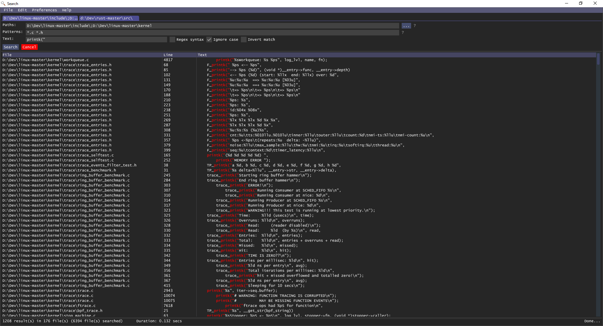

# *Search*

Search was an experiment on creating a UI to search file content, recursively
exploring directory. Such UI already exist, but the many I have tried lack some
features which I thought would be very useful.



## Building

On Windows, you can simply run `cargo build` or `cargo build --release`.

On Linux, you first need to install libgtk.
```
> apt update
> apt install -y libgtk-3-dev
> cargo build
```

## Usage (Command line arguments)

```
Usage: search.exe [OPTIONS]

Options:
      --workspace <WORKSPACE>  Path of the workspace in which to start the program. Default is current workspace
      --paths <PATHS>          Default paths to search in. Default is workspace
      --patterns <PATTERNS>    Default patterns used to filter the file names. Default is workspace
  -c, --config <CONFIG>        Path to the config file to use
  -h, --help                   Print help
  -V, --version                Print version
```

## How is *Search* different?

### Multithreading

The first feature I absolutely wanted in *Search* was multithreading search.
Indeed, I worked on very large project where most searching would simply be
way too slow to be used. [ripgrep](https://github.com/BurntSushi/ripgrep) was
a life saver, but is only a command line tools.

### Tabs

One of the guiding principle of this UI is to offer tabs, similar to what
browsers do. Browser develop a lot of techniques to allow users to efficiently
navigate the internet and this can be re-used in a search program.

### Open in your text editor

User of [Total Commander](https://www.ghisler.com/) will be familiar with it's
ability to open files in a configured editor, using a shortcut (F4 by default).
Similarly, this was something I absolutely wanted and use all the time.


### Pipes searching

> :warning: This is currently not implemented.

Complex regexes can probably allow you to find accurately everything, but
personally I rather use the complex of "pipes" to find something. With grep,
it could be something like:
```
> grep -iRF main src/ | grep -viF fn
```
This command does a initial recursive search for the literal string "main"
starting in directory "src/" and search this result to find every lines, not
containing the literal word "fn".

I use this pattern fairly often, because I often find it easier than to build
the right regex pattern. Furthermore, this can be combined with the after and
the before context.

An other goal was to support such a system in *Search*.

### Avoid optimizations that trade-off quality

This encompass quite a lot of things, but overall I don't want to do the
following optimizations.
- Directly parse NTFS index to bypass Windows filesystem functions.
- Index files before searching.
- Cache results.

The reason boils down that it doesn't seem necessary and would affect
portability, reliability and accuracy. Note that, doing twice the exact
same search could still give drastically different information, due to
OS level caching.

### Icons
- The magnifier icon used as icon is from https://icons8.com/ and can be found [here](https://icons8.com/icon/p3miLroKw4iR/magnifying-glass-tilted-left).
